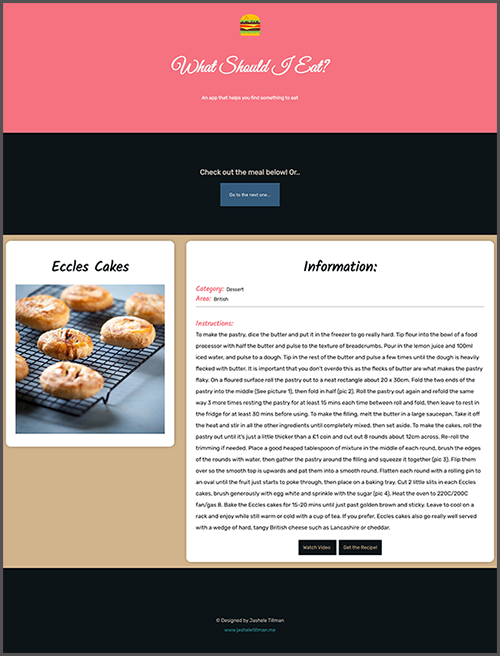

# Recipe App
This React app allows users to generate a random meal on button click. 3rd party API data was implemented using Axios and the selected data that users see on each request is: `title`, `photo`, `instructions`, `category`, and `area`.

# Tech Stack
- React
- Axios
- Redux

# Preview

# Network
- [JasheleTillman.Me](https://jasheletillman.me/ "Personal Site")
- [LinkedIn](https://www.linkedin.com/in/jashelet/ "LinkedIn")
- [Twitter](https://twitter.com/jasheloper "Twitter")
